# Tomasulo Out-of-Order RISC-V Processor

This repository contains a SystemVerilog implementation of an out-of-order RISC-V processor based on Tomasulo's algorithm. The design implements the RV32I instruction set (excluding FENCE*, ECALL, EBREAK, and CSRR instructions) and a subset of the M extension.

## Architecture Overview

The processor implements a full Tomasulo-based out-of-order execution pipeline with the following key components:

- **Fetch Unit**: Responsible for fetching instructions from instruction memory
- **Decode Unit**: Decodes instructions and allocates reservation stations
- **Reservation Stations**: Hold instructions waiting for operands to become available
- **Execution Units**: Specialized functional units including:
  - Arithmetic Logic Unit (ALU)
  - Multiplication/Division Unit
  - Load/Store Unit
- **Common Data Bus (CDB)**: Broadcasts results to all waiting reservation stations
- **Reorder Buffer (ROB)**: Ensures in-order commitment of instructions for precise exceptions
- **Register File**: Maintains architectural register state with register renaming
- **Branch Predictor**: Predicts branch outcomes to minimize pipeline disruptions

## Repository Structure
        .
        ├── hdl/                       # SystemVerilog implementation files
        │   ├── cpu.sv                 # Top-level CPU module integrating all components
        │   ├── fetch.sv               # Instruction fetch unit with branch prediction interface
        │   ├── decode.sv              # Instruction decoder and reservation station allocator
        │   ├── rob.sv                 # Reorder buffer for in-order commitment
        │   ├── cdb.sv                 # Common data bus for result broadcasting
        │   ├── reservation_stations/  # Reservation station implementations
        │   ├── calculation_units/     # ALU, MUL/DIV, and other execution units
        │   ├── cache.sv               # Instruction and data cache modules
        │   ├── register.sv            # Register file with renaming support
        │   └── bp.sv                  # Branch predictor implementation
        │
        ├── docs/                      # Documentation and specifications
        │   ├── datapath.drawio.svg    # Visual diagram of processor architecture
        │   ├── WHAT_IS_AN_OOO.md      # Explanation of out-of-order concepts
        │   ├── GUIDE.md               # Implementation guidelines and tips
        │   └── ADVANCED_FEATURES.md   # Documentation for advanced features
        │
        ├── testcode/                  # RISC-V test programs and benchmarks
        │
        ├── sim/                       # Simulation and verification environment
        │
        └── hvl/                       # Hardware verification language testbenches

## Design Features

- Full RV32I base instruction set support (with noted exceptions)
- Out-of-order execution with in-order commitment
- Register renaming to eliminate false dependencies
- Speculative execution with branch prediction
- Memory hierarchy with caches
- Precise exception handling through the reorder buffer

## Performance Optimizations

The processor incorporates several performance optimizations:
- Instruction-level parallelism through out-of-order execution
- Dynamic scheduling via Tomasulo's algorithm
- Speculative execution to minimize branch penalties
- Multiple execution units for concurrent instruction processing
- Memory access optimization

## Implementation Technology

The design is implemented in SystemVerilog HDL and can be synthesized for FPGA or ASIC targets.
